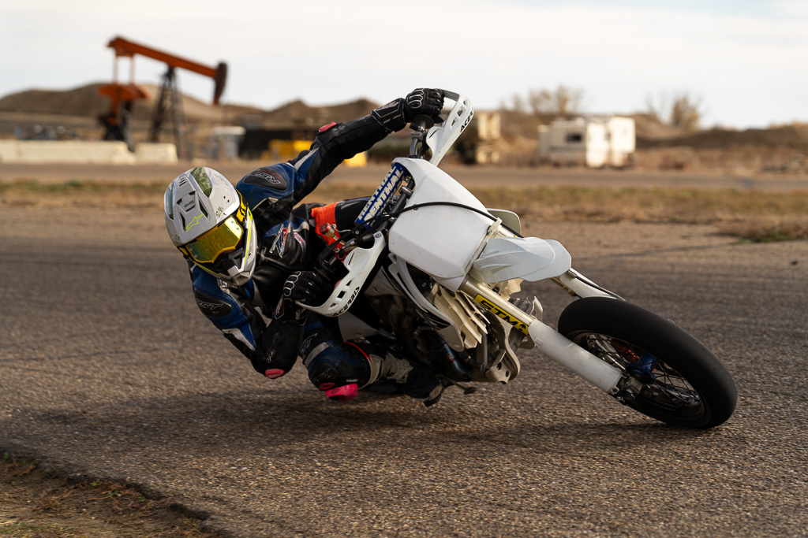

Todo Moto was built on a simple idea: create a motorcycle shop where every rider feels welcome.

**If it has two wheels, it belongs here.** Adventure bike, cruiser, chopper, dirt bike, pit bike, e-bike, or scooter: we work on it all. And if it doesn't ride yet, we'll help get it there.

We're riders and mechanics based in Boulder, and we treat every bike like it's our own.

## Our Story

The name Todo Moto comes from one of our founders' rides through South America.

All over the continent, small independent shops with hand-painted signs reading “todo moto” popped up along the way. They weren't flashy, just honest, local spots where you could find parts, get repairs, and talk bikes with people who cared. When something broke miles from anywhere, those shops kept the journey going.

That spirit stuck with us.

So we built our own version here in Boulder: a reliable place to turn for maintenance, repairs, and straight answers. No gatekeeping. No dealership vibes. Just good work and a welcoming shop.

We're Amber, Grant, and Spencer, three mechanics who love motorcycles and believe everyone deserves a place to ride in, ask questions, and feel at home.
